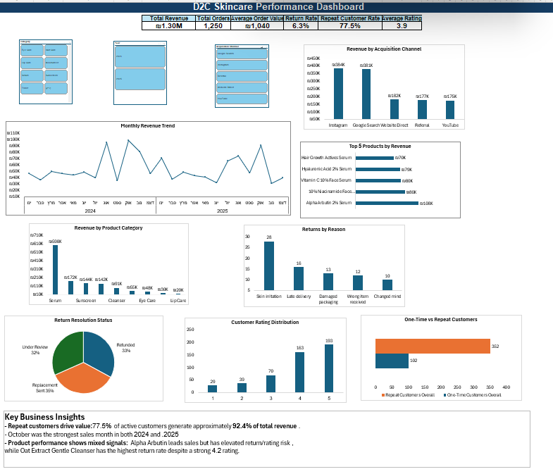
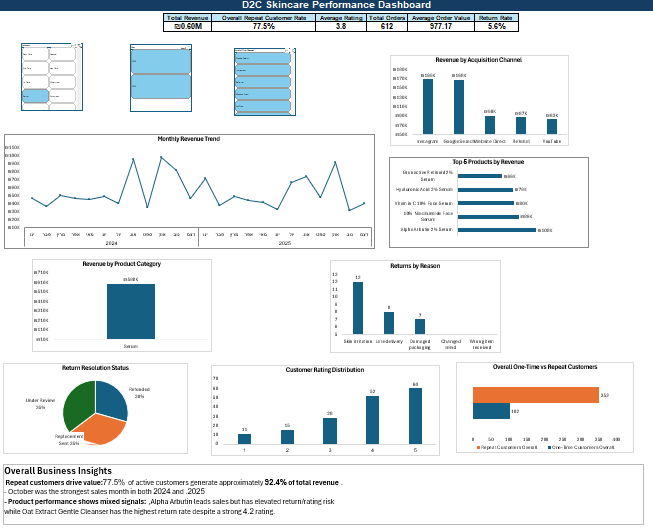
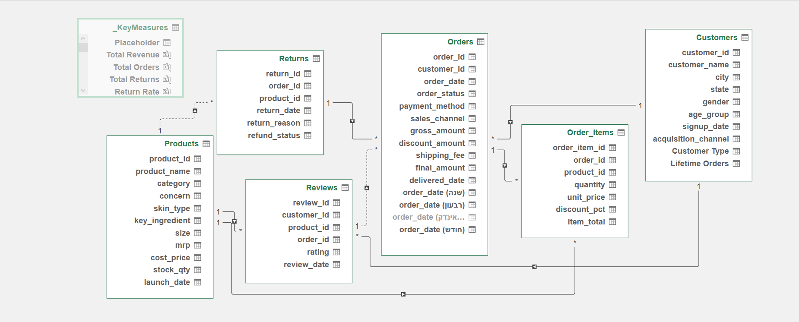

# D2C Skincare E-Commerce Analytics — Excel

## Project Overview

This project analyzes a synthetic direct-to-consumer skincare e-commerce dataset using Microsoft Excel.

The goal was to transform multiple related business tables into a structured analytical model and identify important patterns across:

- Sales performance
- Product performance
- Customer behavior
- Returns
- Acquisition channels
- Customer ratings

The final deliverable is an interactive Excel dashboard built using Power Query, Power Pivot, DAX, PivotTables, PivotCharts, and slicers.

> **Note:** This project uses a synthetic dataset created for educational and portfolio purposes. It does not represent a real company or real customer transactions.

---

## Business Problem

The business data is distributed across several related tables covering customers, products, orders, returns, and reviews.

The objective of the analysis was to combine these tables into a usable analytical model and answer questions such as:

- How is revenue performing over time?
- Which products and categories generate the most revenue?
- Which products combine strong sales with elevated return or rating risk?
- How important are repeat customers to overall business performance?
- Which acquisition channels generate the most customers, orders, and revenue?
- What are the main patterns in product returns?
- How do customer ratings compare with return behavior?
- Which products or categories should receive further investigation?

---

## Tools Used

- Microsoft Excel
- Power Query
- Power Pivot
- Excel Data Model
- DAX
- PivotTables
- PivotCharts
- Slicers

---

## Dataset

The dataset contains six relational business tables:

| Table | Records |
|---|---:|
| Customers | 500 |
| Products | 28 |
| Orders | 1,250 |
| Order_Items | 2,042 |
| Returns | 79 |
| Reviews | 494 |

### Main Relationships

- Customers → Orders
- Orders → Order_Items
- Products → Order_Items
- Orders → Returns
- Products → Returns
- Customers → Reviews
- Products → Reviews
- Orders → Reviews

---

## Data Cleaning and Validation

Before analysis, all six tables were reviewed for data-quality issues.

The validation process included:

- Duplicate checks
- Missing-value checks
- Primary-key uniqueness
- Relationship validation
- Date validation
- Numeric validation
- Categorical consistency
- Review of suspicious or impossible values

No unresolved data-quality issues remained before analysis.

---

## Core KPIs

| KPI | Result |
|---|---:|
| Total Revenue | **₪1,300,021** |
| Total Orders | **1,250** |
| Average Order Value | **₪1,040.02** |
| Overall Return Rate | **6.3%** |
| Repeat Customer Rate | **77.5%** |
| Average Rating | **3.9** |

### Important Metric Distinction

Two different return metrics were used.

**Overall Return Rate**  
Return events relative to total orders.

**Product Return Rate**  
Product returns divided by units sold.

The overall product-level return-rate benchmark was approximately **3.06%**.

---

## Analysis Approach

The analysis was completed in several stages:

1. Data validation and preparation
2. Relational data modeling
3. KPI development using DAX
4. Sales trend analysis
5. Product and category analysis
6. Return-risk analysis
7. Customer segmentation
8. Acquisition-channel analysis
9. Customer review analysis
10. Interactive dashboard development

The analysis intentionally compared multiple metrics before drawing conclusions.

For example:

- High revenue was not automatically treated as strong overall product performance.
- High return rates were not automatically interpreted as poor customer satisfaction.
- Lower ratings were not assumed to produce higher returns.
- High acquisition volume was not automatically interpreted as highest customer value.

---

# Key Business Insights

## 1. Repeat Customers Contribute the Majority of Revenue

Repeat customers represent **77.5% of active customers** and generate approximately **92.4% of total revenue**.

Repeat customers also have a higher Average Order Value:

- Repeat Customer AOV: **₪1,045.88**
- One-Time Customer AOV: **₪974.08**

This shows that repeat customers contribute value through both higher purchase frequency and slightly higher spending per transaction.

**Business Insight:**  
Repeat purchasing is a major component of business performance in the dataset.

---

## 2. Revenue Generally Moves with Order Volume

Monthly revenue and order volume generally moved in the same direction, suggesting that transaction volume was an important contributor to monthly revenue performance.

Average Order Value also created meaningful exceptions.

For example, **December 2024 had the lowest order volume but the highest AOV of the year**, showing that higher spending per order partially offset lower transaction volume.

**Business Insight:**  
Revenue should be evaluated using both order volume and Average Order Value rather than revenue alone.

---

## 3. October Was the Highest-Revenue Month in Both Years

October generated the highest revenue in both **2024 and 2025**.

In 2025, October also recorded the highest order volume.

By contrast, **November 2025** recorded:

- The lowest revenue
- A tie for the lowest order volume
- The lowest AOV of the year

**Business Insight:**  
October consistently represented a strong sales period, while November 2025 showed the clearest combination of weak order volume and low customer spending.

---

## 4. Serum Is the Largest Revenue Category and a High-Priority Investigation Area

Serum generated **₪598,031**, substantially more revenue than any other product category.

It also recorded:

- **34 product returns**
- Product Return Rate: **3.70%**
- Average Rating: **3.8**

The overall product-level return-rate benchmark was approximately **3.06%**, while the overall average rating was **3.9**.

**Business Insight:**  
Serum is commercially significant and also shows elevated return and rating risk, making it a high-priority category for further investigation.

---

## 5. Alpha Arbutin 2% Serum Leads Sales but Shows Risk Signals

Alpha Arbutin 2% Serum was the strongest individual product by both revenue and units sold:

- Revenue: **₪107,734**
- Units Sold: **166**
- Product Returns: **9**
- Product Return Rate: **5.42%**
- Average Rating: **3.7**

Its return rate was above the overall product-level benchmark, while its rating was below the overall average.

**Business Insight:**  
Strong sales performance does not automatically indicate strong overall product performance. Alpha Arbutin should be investigated further before additional promotional investment is considered.

---

## 6. High Return Rates Do Not Always Mean Low Satisfaction

Oat Extract Gentle Cleanser had the highest product return rate at approximately **7.69%**.

Its product metrics were:

- Revenue: **₪19,435**
- Units Sold: **65**
- Product Returns: **5**
- Average Rating: **4.2**

Despite its high return rate, the product maintained a strong rating.

A similar pattern appeared at category level with Moisturizer, which had a product return rate of approximately **3.61%** while maintaining the strongest category rating of **4.1**.

**Business Insight:**  
Returns and ratings do not always move together. Return reasons and customer feedback should be investigated before assuming that high returns represent poor customer satisfaction.

---

## 7. Lower Ratings Do Not Automatically Lead to Higher Returns

Eye Care had the lowest category rating at **3.7**, but its product return rate was approximately **2.70%**, below the overall product-level benchmark.

This contrasts with categories such as Serum and Moisturizer, which had higher return rates despite equal or better ratings.

**Business Insight:**  
Ratings and returns provide different signals about product performance and should not be used interchangeably.

---

## 8. Acquisition Channels Deliver Different Types of Value

Google Search generated the highest number of active customers and orders in the completed analysis.

Instagram generated the highest revenue:

- **₪384,275**

Website Direct generated the highest Average Order Value:

- **₪1,070.88**

**Business Insight:**  
No single acquisition channel performed best across every metric. Channel performance should therefore be evaluated using customer volume, orders, revenue, and transaction value together.

---

# Business Recommendations

## Prioritize Repeat Purchasing and Retention

Repeat customers generate approximately **92.4% of total revenue** and have a higher AOV than one-time customers.

Recommended actions:

- Encourage second purchases from one-time customers.
- Develop retention campaigns for existing customers.
- Track repeat purchase behavior over time.
- Analyze characteristics of high-value repeat customers.

---

## Investigate the Drivers Behind October Performance

October was the highest-revenue month in both years.

Recommended actions:

- Compare October with surrounding months by order volume, AOV, product mix, and acquisition channel.
- Identify products or categories that contributed disproportionately to October revenue.
- Investigate possible seasonality, promotions, or other business factors before attempting to replicate the result.

---

## Investigate November 2025 Underperformance

November 2025 combined low revenue, low order volume, and low AOV.

Recommended actions:

- Compare November with stronger months.
- Analyze performance by product category and customer segment.
- Determine whether the decline was more heavily associated with lower order volume or lower transaction value.

---

## Prioritize Serum for Further Investigation

Serum combines the highest category revenue with elevated return activity and a slightly below-average rating.

Recommended actions:

- Analyze Serum return reasons.
- Compare individual Serum products by revenue, returns, and ratings.
- Prioritize commercially important Serum products with elevated risk indicators.

---

## Review Alpha Arbutin 2% Serum

Alpha Arbutin leads both revenue and unit sales but has an above-average product return rate and below-average rating.

Recommended actions:

- Review return reasons and customer feedback.
- Compare its return behavior with other high-volume Serum products.
- Investigate recurring issues before significantly increasing promotional investment.

---

## Investigate Oat Extract Gentle Cleanser Separately from Rating Performance

Oat Extract Gentle Cleanser has the highest product return rate but also maintains a strong rating.

Recommended actions:

- Analyze return reasons specifically for this product.
- Compare return behavior with customer feedback.
- Investigate operational and fulfillment-related explanations in addition to satisfaction-related explanations.
- Avoid assuming that high returns automatically indicate poor product quality.

---

## Evaluate Acquisition Channels Using Multiple KPIs

No single acquisition channel leads every performance measure.

Recommended actions:

- Evaluate channels using customer count, orders, revenue, and AOV together.
- Avoid ranking channel performance solely by acquisition volume.
- Investigate whether higher-value channels also produce stronger repeat-purchase behavior.

---

## Analyze Ratings and Returns Together

The analysis showed that ratings and returns do not always move in the same direction.

Recommended actions:

- Monitor both metrics separately.
- Use return reasons to contextualize high-return products.
- Use ratings to identify satisfaction concerns that may not result in returns.
- Avoid using either metric independently as a complete measure of product performance.

---

# Dashboard

The final Excel dashboard includes six primary KPIs:

- Total Revenue
- Total Orders
- Average Order Value
- Return Rate
- Repeat Customer Rate
- Average Rating

The dashboard also contains:

- Monthly Revenue Trend
- Top 5 Products by Revenue
- Revenue by Product Category
- Returns by Reason
- Return Resolution Status
- One-Time vs Repeat Customers
- Revenue by Acquisition Channel
- Customer Rating Distribution

### Interactive Slicers

- Year
- Product Category
- Acquisition Channel

The lifetime One-Time vs Repeat Customer classification remains fixed by design rather than being redefined by the Year filter.

---

## Dashboard Preview

### Full Dashboard



### Filtered Dashboard Example



### Data Model / Analysis View



---

# Known Limitation

The workbook contains a minor slicer limitation in which a `(blank)` member may appear in some slicers even though the validated source fields contain values.

Power Query diagnostic checks performed during development did not identify unmatched product IDs in the tested product relationships.

This limitation does not affect the validated baseline KPIs or the main analytical conclusions of the project.

---

# Skills Demonstrated

This project demonstrates practical use of:

- Data cleaning and validation
- Relational data modeling
- Power Query
- Power Pivot
- DAX measures
- Calculated columns
- PivotTables
- PivotCharts
- Slicers and Report Connections
- KPI development
- Sales analysis
- Product analysis
- Return-risk analysis
- Customer segmentation
- Repeat-purchase analysis
- Acquisition-channel analysis
- Review analysis
- Dashboard development
- Business insight generation
- Distinguishing observations from assumptions

---

# Project Files

```text
D2C-Skincare-Ecommerce-Analysis/
│
├── README.md
├── D2C_Skincare_Ecommerce_Analysis.xlsx
│
├── data/
│   └── dataset_after.xlsx
│
└── images/
    ├── dashboard-overview.png
    ├── dashboard-filtered.png
    └── data-model.png
```

---

# Project Summary

This project transformed a six-table relational e-commerce dataset into an interactive Excel analytics solution.

The analysis found that repeat customers contribute the majority of revenue, monthly revenue generally moves with order volume, Serum is both the largest revenue category and an important investigation area, and product ratings and return behavior do not always move together.

The project demonstrates how Excel can be used for relational modeling, multi-dimensional business analysis, dashboard development, and evidence-based decision support.
